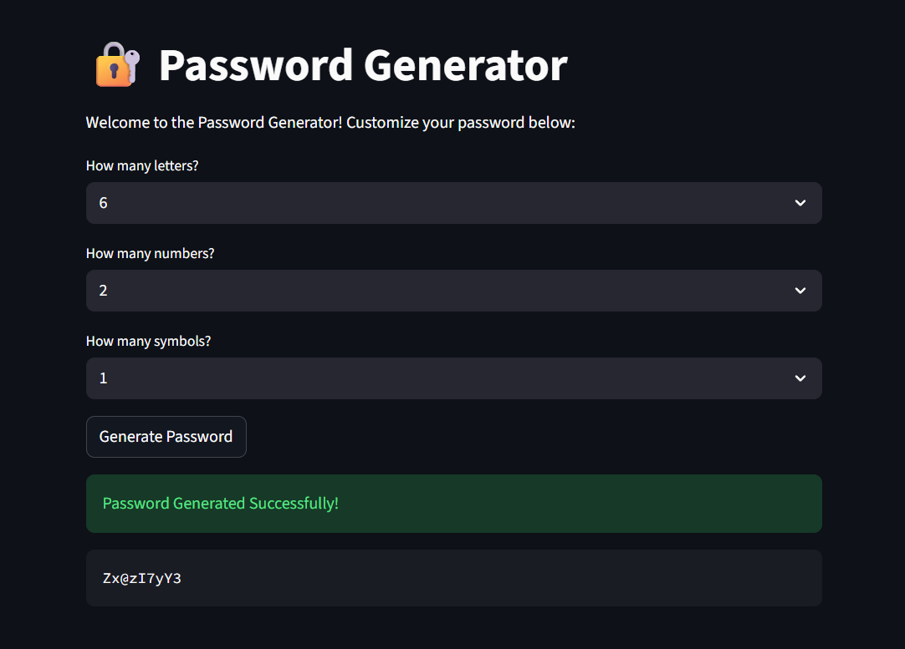

#  Password Generator (Python Mini Project)



A simple and interactive Python notebook that generates secure, customizable passwords.
Users can define how many letters, numbers, and symbols they want, and the script creates a randomized password using Python's built-in libraries.

---

##  About the Project

This password generator lets users create strong passwords based on custom rules:

* Define the number of **letters**, **numbers**, and **symbols**
* Passwords are randomized using Python’s `random` and `string` modules
* Helps build secure passwords for online accounts, apps, and more

---

## 🛠️ Built With

* Python 3
* Jupyter Notebook (`.ipynb`)
* `random` module
* `string` module
* Basic input handling and control flow

---

## 🚀 How to Use

1. Open the notebook using **Jupyter Notebook** or **JupyterLab**.
2. Run all the cells in order.
3. Follow the on-screen prompts to generate your password.

---

## 💡 Example Output

```text
WELCOME TO THE PASSWORD GENERATOR!!!!
How many letters would you like in your password: 5
How many numbers would you like: 3
How many symbols would you like: 2
Here is your password: 9#RuLt1@K
```
